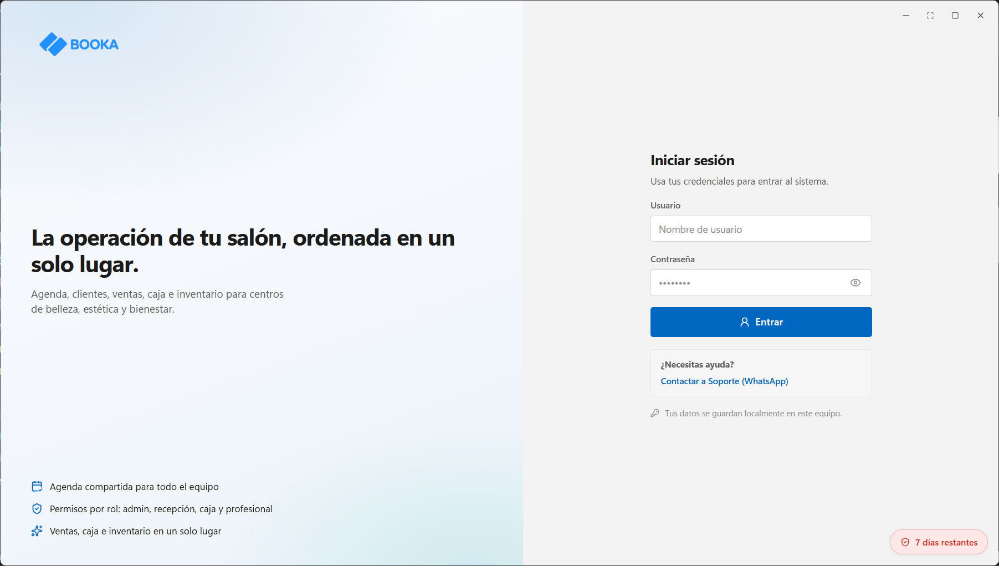
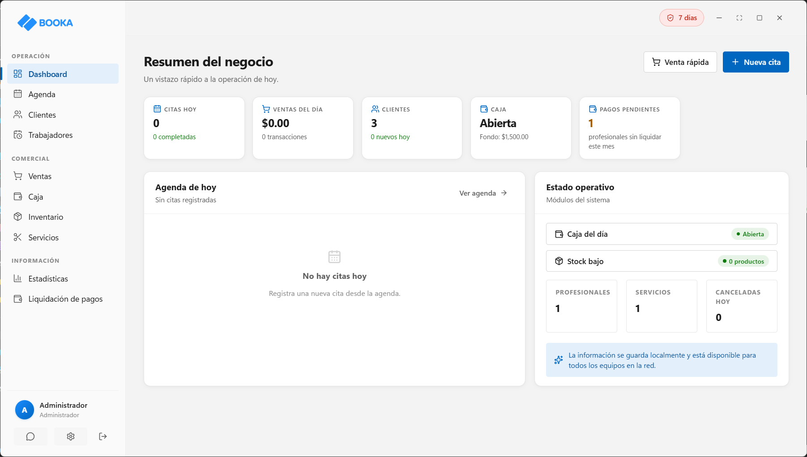
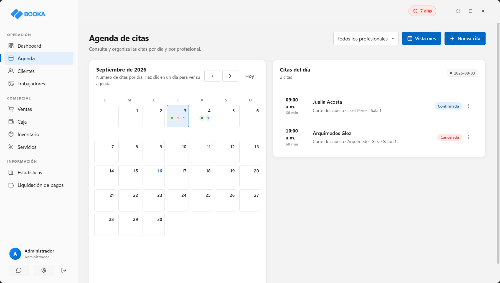
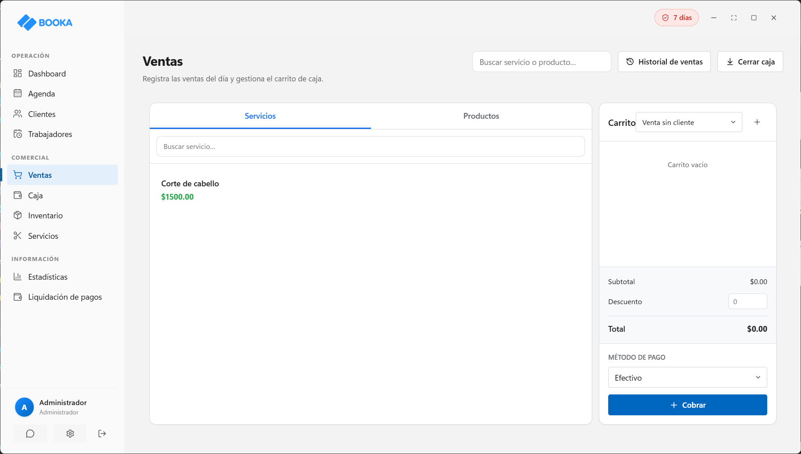
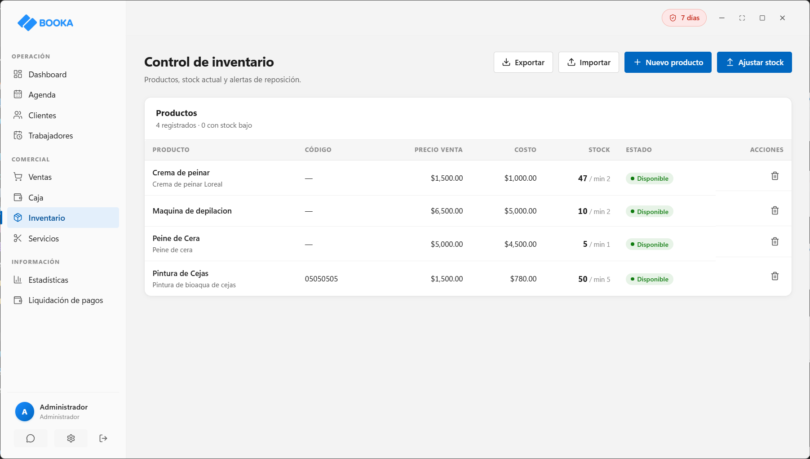
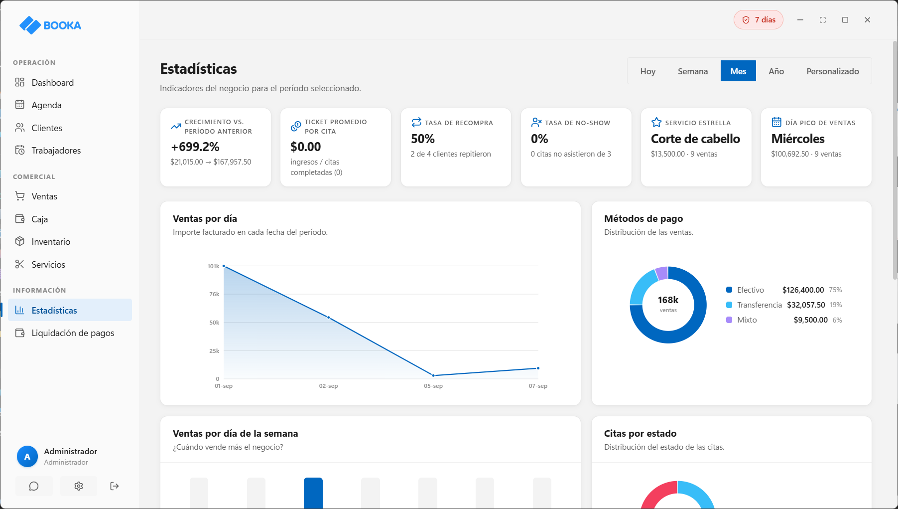

# BOOKA — Sistema de Gestión para Salones

La operación de tu salón, ordenada en un solo lugar: agenda de citas, clientes, trabajadores, ventas, caja, inventario y estadísticas en una sola aplicación de escritorio. Optimizado para entornos multiusuario en red local (LAN).

## ✨ Funcionalidades

- **Agenda de citas** — calendario visual por profesional, con estados de cada cita.
- **Gestión de clientes** — ficha de clientes con historial y datos de contacto.
- **Trabajadores** — perfiles, horarios semanales y liquidación de pagos.
- **Punto de venta** — venta de servicios y productos con carrito y métodos de pago.
- **Control de caja** — apertura, movimientos del día e historial de caja.
- **Inventario** — stock de productos con alertas y ajustes.
- **Estadísticas** — ventas por día, métodos de pago y servicios más vendidos.

## 📸 Capturas

| Panel principal | Agenda de citas |
|---|---|
|  |  |

| Punto de venta | Inventario |
|---|---|
|  |  |

| Estadísticas |
|---|
|  |

## 🔐 Licenciamiento

BOOKA utiliza un modelo de licencias por tiempo, adaptable a las necesidades de cada salón.

- **Licencia por equipo** — basada en HWID (Hardware ID) único, garantiza el uso exclusivo de tu licencia.
- **Activación flexible** — presencial (durante la instalación técnica) o remota (códigos de solicitud/activación).
- **Seguridad** — detección de manipulación de fecha del sistema y firma digital.
- **Multiusuario LAN** — arquitectura servidor-cliente para conectar múltiples puestos de trabajo.
- **Soporte prioritario** vía WhatsApp durante la vigencia de tu licencia.

## 🛠️ Stack

Electron · React · TypeScript · SQLite · IPC

## 👨‍💻 Autor

**Arquímedes González** — Full Stack & Cross-Platform Developer
📧 arqgonzcor@gmail.com · 💼 [github.com/AglezDev](https://github.com/AglezDev)
